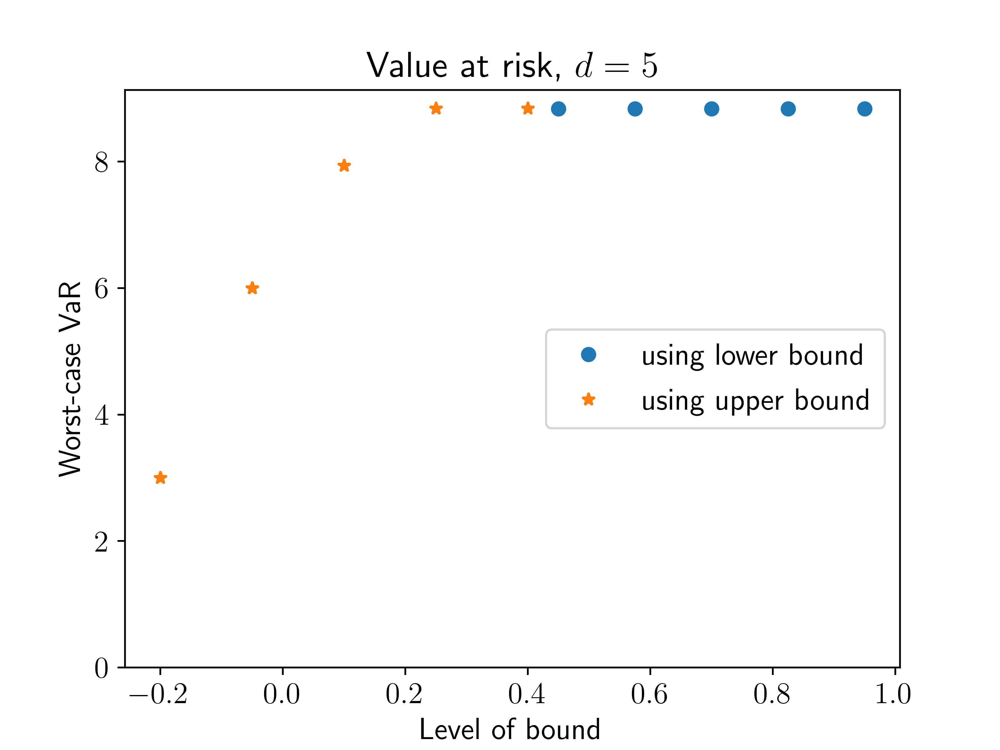
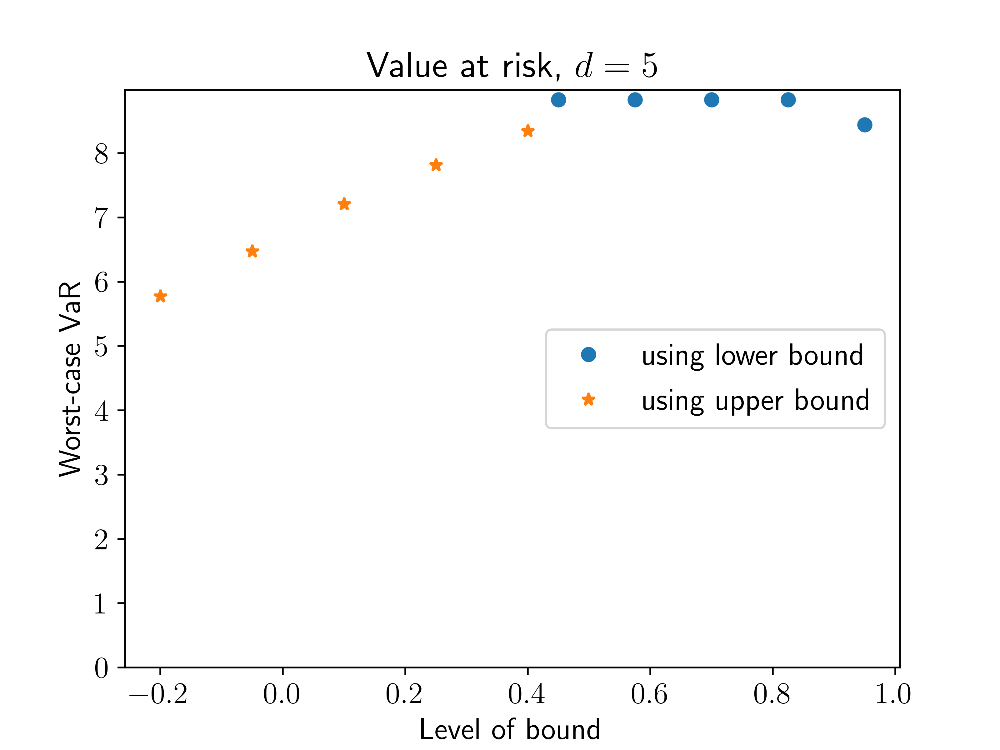

# Risk aggregation with additional (conditional) covariance information

This repository provides code for the problem of aggregating individual risks under constraints on the dependence structure. The usual robust risk aggregation problem involves an outer optimization for value-at-risk or expected shortfall, where the inner steps solve a multi-marginal optimal transport problem. In this repository, the inner problem is instead a multi-marginal optimal transport problem with additional linear constraints. The linear constraints restrict the dependence structure across pairs of variables, with the main focus being that either covariances or conditional covariances have to lie between specified bounds.

## Requirements

To run the code, we used python 3.7 and anaconda. The non-default packages are scipy, seaborn, gurobipy and rearrangement-algorithm. Notably, for gurobipy an installed version of gurobi is necessary, which was used under an academic license.
An anaconda environment.yml file and requirements.txt file are included.
For the setup of the environment, if using anaconda, run


```setup
conda env create -f environment.yml
```

or, using pip, run

```setup
pip install -r requirements.txt
```

## Experiments
Simple examples for value at risk and expected shortfall risk aggregation are included in the folder examples, where the main files are testcases_var.py for value at risk, and testcases_es.py for expected shortfall.

The main purpose of these experiments is to compare unconditional and conditional covariance constraints, showing that unconditional constraints are mainly effective for extreme levels of bounds, and that conditional constraints can be effective even for more moderate levels of bounds. The images below show the effect of the constraint that all covariances between all 5 portfolio constituents have to lie either below or above a certain level given on the x-axis (normalized to correlation). The only difference is that for the left hand image, unconditional covariances are used, and for the right hand image, covariances conditional on the event that both losses are simultaneously above their median level. One observes that for unconditional constraints, one only observes an effect when upper bounding correlation by at most ~0.15, while for conditional constraints, even upper bounding correlation by ~0.4 has a significant effect.
The takeaway is that tail risk measures such as value at risk or expected shortfall are rarely restricted by global constraints such as unconditional covariances, and if one wants to effectively restrict the worst-case risks, more specific constraints must be imposed.



